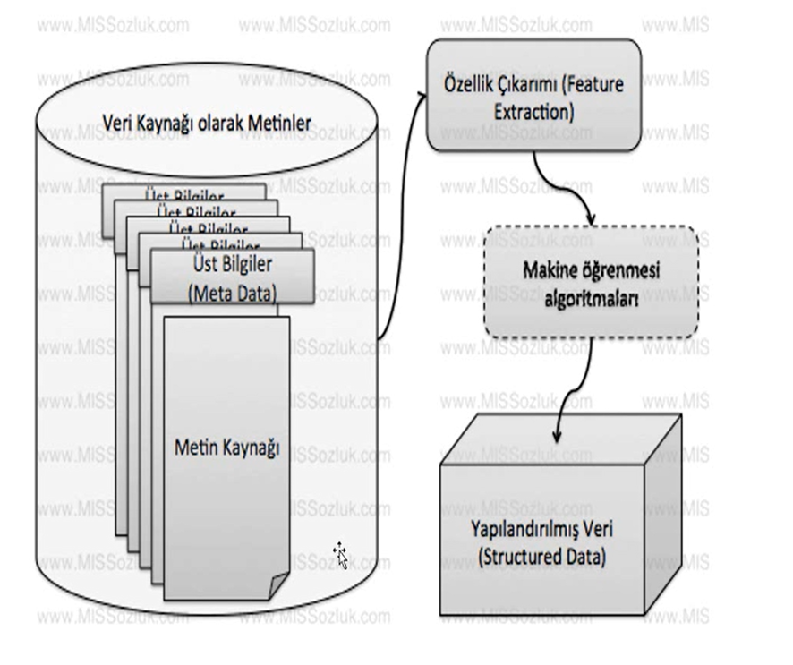
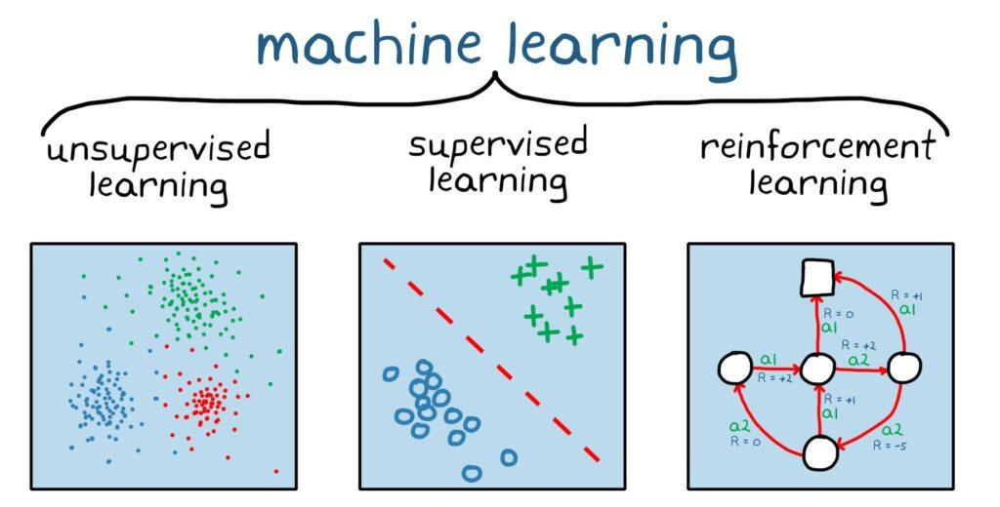
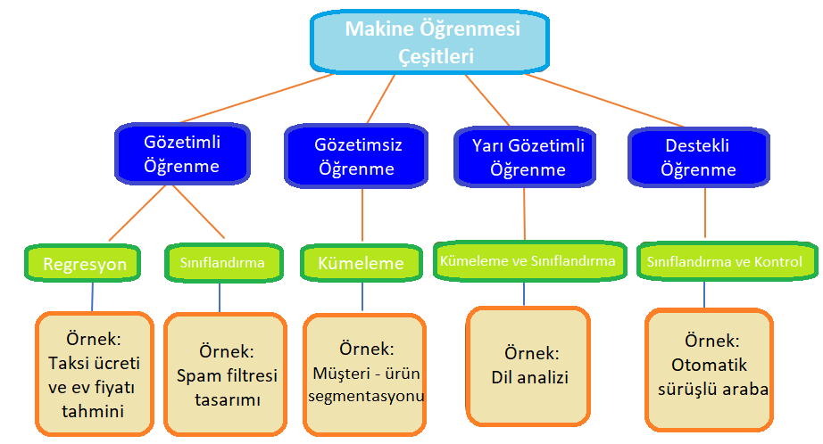
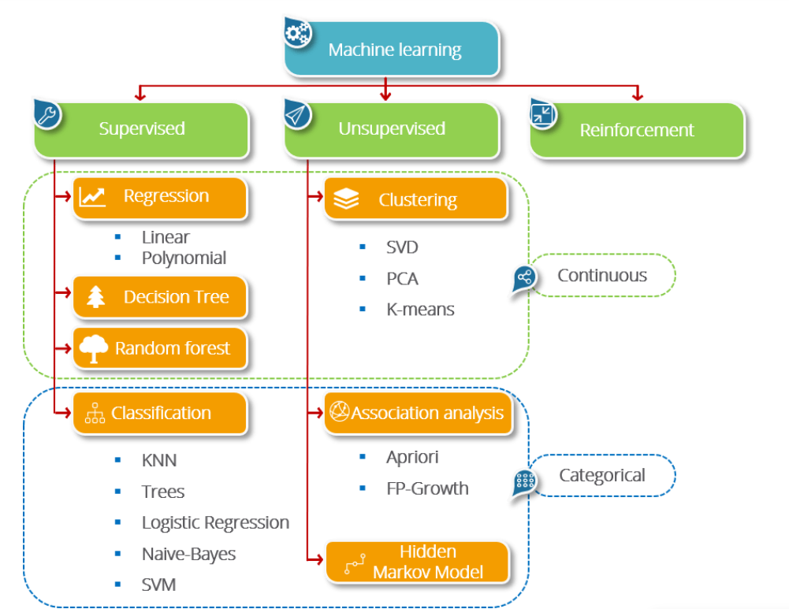

# İçindekiler

1. [Metin Madenciliği](#metin-madenciliği)
   - [Metin Üzerinden Yapılandırılmış Veri Elde Etme](#🔍-metin-üzerinden-yapılandırılmış-veri-elde-etmeyi-amaçlar)
   - [Metin Madenciliği Yöntemleri](#metin-madenciliği-yöntemleri)
   - [Metin Madenciliği ve Doğal Dil İşleme](#metin-madenciliği-ve-doğal-dil-i̇şleme)
2. [Metin Madenciliği Uygulaması](#metin-madenciliği-uygulaması)
3. [Metin Madenciliğinin Çalışma Alanları](#metin-madenciliğinin-çalışma-alanları)
   - [Enformasyon Getirimi](#enformasyon-getirimi)
   - [Doğal Dil İşleme](#doğal-dil-i̇şleme)
   - [Adlandırılmış Varlık Tanıma](#adlandırılmış-varlık-tanıma)
   - [Örüntü Tanımlı Varlıklar](#örüntü-tanımlı-varlıklar)
   - [Eş Atıf](#eş-atıf)
   - [İlişki, Kural, Olay Çıkarımı](#i̇lişki-kural-olay-çıkarımı)
   - [Duygu Analizi](#duygu-analizi)
4. [Öznitelik (Feature)](#öznitelik-feature)
5. [Öznitelik Çıkarımı (Feature Extraction)](#öznitelik-çıkarımı-feature-extraction)
6. [Makine Öğrenmesi](#makine-öğrenmesi)
   - [Gözetimli Öğrenme (Supervised Learning)](#gözetimli-öğrenme-supervised-learning)
   - [Gözetimsiz Öğrenme (Unsupervised Learning)](#gözetimsiz-öğrenme-unsupervised-learning)
7. [Sınıflandırma (Classification)](#sınıflandırma-classification)
8. [Kümeleme (Clustering)](#kümeleme-clustering)
9. [NLP](#nlp)

# Metin Madenciliği

En basit anlamda, metin madenciliği çalışmaları metni veri kaynağı olarak kabul eden veri madenciliği (data mining) çalışmasıdır.

## 🔍 Metin üzerinden yapılandırılmış (structured) veri elde etmeyi amaçlar.
- **Sınıflandırılması**
- **Bölütlenmesi (Clustering)**
- **Metinlerden Konu Çıkarılması (Concept/Entity Extraction)**
- **Sınıf Taneciklerinin Üretilmesi (Production of Granular Taxonomy)**
- **Duygusal Analiz (Sentimental Analysis)**
- **Metin Özetleme (Document Summarization)**
- **Varlık İlişki Modellemesi (Entity Relationship Modelling)**
## gibi çalışmaları hedefler.

Yukarıdaki hedeflere ulaşılması için metin madenciliği çalışmaları kapsamında enformasyon getirimi (information retrieval), hece analizi (lexical analysis), kelime frekans dağılımı (word frequency distribution), örüntü tanıma (pattern recognition), etiketleme (tagging), enformasyon çıkarımı (information extraction), veri madenciliği (data mining) ve hatta görselleştirme (visualization) gibi yöntemleri kullanmaktadır.

Metin madenciliği çalışmaları, metin kaynaklı literatürdeki diğer bir çalışma alanı olan **doğal dil işleme (natural language processing, NLP)** çalışmaları ile çoğu zaman beraber yol yürümektedir. Doğal dil işleme çalışmaları daha çok yapay zeka altında dil bilimi bilgisine dayalı çalışmalarını kapsamaktadır. Metin madenciliği çalışmaları ise daha çok **istatistiksel** olarak metin üzerinden sonuçlara ulaşmayı hedefler. Metin madenciliği çalışmaları sırasında çoğu zaman doğal dil işleme kullanılarak özellik çıkarımı da yapılmaktadır.

- Bir metin veri tabanından alınan veriler öncelikle bir özellik çıkarımına tabi tutulur. (feature extraction) 

- Çıkarılan özellikler üzerinde bir makine öğrenmesi algoritması çalışır. (sınıflandırma (classification), bölütleme (clustering), tahmin (prediction) vb.) Genelde kullanılır. Ama bazı durumlarda ise makine öğrenmesi adımı yerine, **istatistiksel bazı farklı yöntemler** kullanılabilir.

- Neticede yapılandırılmış veri (structured data) elde edilir.

## Metin Madenciliği Uygulaması

-100 yazı ve 5 yazar var, her birinin 20 yazısı bulunuyor. 101. yazının hangi yazara ait olduğunu bulmak için kelime sıklıklarını özellik çıkarımı olarak kullanıyoruz (author attribution). KNN algoritması ile yazar tahmin edilerek, olası yazarlar listesi oluşturuluyor ve en yüksek ihtimalle yazarı belirliyoruz. Bu yazar tanıma (author recognition) problemidir.

## Metin madenciliğinin çalışma alanları

-**Enformasyon Getirimi:** Külliyat hakkında ön bilgi toplama aşaması (web sayfaları, dosya bilgileri, kullanıcı bilgileri vb.).

-**Doğal Dil İşleme:** Özellik çıkarımı ve anlamlı bilgi elde etme aşaması (konuşma parçaları, cümlemsel parçalama vb.).

-**Adlandırılmış Varlık Tanıma:** Metinde isimler, yerler, semboller ve kısaltmalar gibi özel varlıkları belirleme.

-**Örüntü Tanımlı Varlıklar:** E-posta, telefon numaraları, adresler gibi özel bilgileri metinden çıkarma

-**Eş Atıf:** Aynı varlığa işaret eden kelime gruplarını bulma.

-**İlişki, Kural, Olay Çıkarımı:** Metinden olay, ilişki ve kuralları çıkarma.

-**Duygu Analizi:** Metinlerdeki duygusal ifadeleri (olumlu, olumsuz vb.) belirleme.

**Öznitelik (Feature):** Makine öğrenmesi ve örüntü tanımada, gözlemlenen olgunun ölçülebilir niteliğidir. Etkili algoritmalar için seçilen özniteliklerin (feature) anlaşılır, ayırt edici ve bağımsız olması kritiktir. Özniteliklerin bir alt kümesi seçilir veya yeni bir öznitelikler kümesi oluşturulur. Bu süreç öznitelik mühendisliği (feature engineering) olarak adlandırılır.

**Öznitelik Çıkarımı (Feature Extraction)**

- Öznitelik çıkarımı, veri kümesini açıklamak için gereken kaynak miktarını azaltmayı hedefler. Çok fazla değişkenin bulunduğu analizler, yüksek bellek ve işlemci gücü gerektirir ve sınıflandırma algoritmalarının aşırı uyum yapmasına neden olabilir. Öznitelik çıkarımı, değişken kombinasyonları oluşturarak bu sorunları aşmayı ve veriyi yeterli doğrulukla açıklamayı amaçlar.

- Öznitelikler, bir alan uzmanı tarafından **öznitelik mühendisliği (feature engineering)** yapılarak çıkarılabilir veya genel boyut indirgeme yöntemleri kullanılabilir.

# Makine Öğrenmesi

## Gözetimli Öğrenme (Supervised Learning) 

Gözetimli Öğrenme (Supervised Learning): Verilen \( X \) girdi kümesinden \( Y \) çıktı kümesinin elde edilmesi için fonksiyon öğrenimidir.Gözetimli öğrenmede, öğrenilmek istenen kavram ile ilgili toplanan gözlemler bir **eğitim kümesi** olarak öğrenciye verilir. Eğitim kümesinde **giriş-çıkış** ilişkisi kurulur ve bu ilişkiyle gelecekteki \( X' \) girdileri için \( Y' \) çıktıları tahmin edilir. **Çıktı değerleri de verilir.** 

## Gözetimsiz Öğrenme (Unsupervised Learning)

Verilerdeki ilişkilerin ve yapıların **etiketleme olmadan** öğrenilmesidir. İki temel yaklaşımı boyut indirgeme ve kümeleme olup, veri örneklerinin uzaklıklarını ve komşuluk ilişkilerini kullanarak çıkarımlar yapılır. Örnek: Sosyal ağlarda “tanıyor olabileceğiniz kişiler” önerisi.**Kısaca gözetimsiz öğrenmede veriler üzerinde bir ayırım yapmadan sisteme yüklenip, algoritma ile onu kendisinin ayırıp, kendisinin öğrenmesini beklenir.**

### Sınıflandırma (Classification): 

Makine öğrenmesi ve istatistikte, yeni bir gözlemin hangi kategoriye ait olduğunu, bilinen gözlemlerden oluşan bir eğitim seti ile belirleme problemidir. Örnek: E-postaları gerekli/gereksiz olarak ayırmak veya hastalık teşhisi yapmak.

### Kümeleme (Clustering):

Nesneleri benzerliklerine göre gruplama problemidir. Aynı kümede yer alan nesneler, diğer kümelerdeki nesnelere göre birbirine daha benzer olmalıdır. Veri madenciliği, istatistiksel veri analizi, makine öğrenimi, görüntü analizi, biyoenformatik ve bilgisayar grafikleri gibi alanlarda kullanılır.

# NLP

- **Doğal Dil İşleme**, yaygın olarak **NLP (Natural Language Processing)** olarak bilinen **yapay zekâ** ve **dilbilim** alt kategorisidir.

- Dil bilimi, yapay zeka ve bilgisayar bilimi
- İnsan dili ile bilgisayarlar arasındaki iletişim
  - Bilgisayar dili: 0, 1 alfabesi
  - Doğal Dil, İnsan Dili: Alfabe, grammer vs.

- Doğal Dil İşleme: İnsan Dili -> Bilgisayarın anlayacağı format

**Fonetik ve Fonoloji**

- **Fonetik**, konuşma seslerini ve bu seslerin dil ile ilişkilerini inceler. Anlam ayırıcı en küçük ses birimine **fon** denir.

- **Fon**, her dilde farklı seslere karşılık gelir. Türkçe gibi dillerde sesler harflere direkt karşılık gelirken, İngilizce gibi dillerde **fonetik alfabe** kullanılır.

- **Fonem**, ses birimlerinin simgesel ifadesidir. 

- Ses birimleri ikiye ayrılır:
  - Parçalı ses birimler (**segmental**)
  - Parçalarüstü ses birimler (**supra-segmental, prosodic**)

  **Sözdizimsel (Sentaktik) Analiz**

- **Sözdizimsel analiz**, cümledeki öğelerin kurallara uyumunu kontrol eder. 

- **Türkçede** cümleler genellikle **özne, nesne** ve **yüklem** bileşenlerinden oluşur. Ek anlamlar için **yer tamlayıcısı** ve **zarf tamlayıcısı** eklenebilir. Özne ve yüklem temel bileşenlerdir, diğerleri isteğe bağlıdır.

- **Bilgisayarla** dil işleme sırasında anlamsız eşleşmelerin önlenmesi için cümlenin doğru yapıda olup olmadığı kontrol edilir. 

- **Simgeler:** Ö: özne, N: nesne, Y: yüklem, vb.

**Anlambilimsel (Semantik) Analiz**

- **Anlambilimsel analiz**, sözdizimsel analiz sonrası, kelimelerin anlamlarının ve birbirleriyle olan ilişkilerinin incelenmesidir. Kelimelerin ve eklerin cümle içindeki konumları belirlenerek **anlam çıkarma** ve **fikir yürütme** gibi bilişsel işlemler için temel oluşturur.

**Yapay Konuşma**

- **Yapay konuşma**, morfolojik çözümleme sonrası elde edilen bilgilerin kurallara uygun şekilde birleştirilmesiyle yapay zekâ veya sistemlere iletişim yeteneği kazandırma sürecidir.

 <mark>

**DDİ Alt Başlıkları**

- **Kelime Bilimi (Etymoloji)**: Kelimelerin köklerini ve diğer dillerle ilişkisini inceler.
- **Söz Dizimi (Syntax)**: Cümle yapısını ve kurallarını analiz eder.
- **Anlamsal Analiz (Semantic)**: Kelime ve cümlelerin anlamını inceler.
- **Anlam Belirsizliği**: Aynı kelimenin farklı anlamlarını analiz eder.

</mark> 

**E. DDİ’de Başlıca Araştırma Konuları**

i. Varlık İsmi Tanıma(NER)
 - Metinde yer alan  
   - özel isimlerin,  
   - tarih, saat, lokasyon,  
   - kişi ve kurum adları.  

ii. Özetleme (Summarization)
 - Çıkarıcı Özetleme ve Soyutlayıcı Özetleme
   - Çıkarıcı özetleme: Metinde yer alan kelime ve cümleler
   - Soyutlayıcı özetleme: Metinde yer almayan kelime ve cümleler

iii. Metin Normalizasyonu (Text Normalization)
 - Yazım hataları - kasti ve kasti olmayan
 - Analizler için yüksek başarı oranı

iv. Metin Sınıflandırma. (Text Classification)
 - Metin sınıflandırma: Anlam, uzunluk vs.
   - Arama motorlarında ilgili dokümanlar
   - Kullanıcıların alışveriş alışkanlıkları

**Token İşlemi**

Metin içerisinde yer alan:  
- Cümleler  
- Kelimeler  
- Noktalama İşaretleri  
- Sayılar  
- Özel semboller  
- Karakterler  

